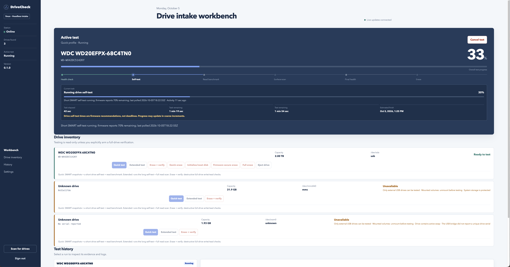

# DriveCheck

Turn a Raspberry Pi and a USB drive dock into an automatic hard-drive testing
station. Dock a drive, check its health and read speed, get results on your phone,
and receive confirmation when it is safe to remove.

DriveCheck runs locally, with a live web dashboard and saved reports. No Docker,
cloud service, or frontend build is required.



## Features

- **Quick testing:** SMART health, a short drive self-test, and a read benchmark.
- **Extended testing:** a long self-test and full-drive read scan, with timing estimates.
- **Headless intake:** automatic Quick testing and safe eject, with a configurable
  window to choose another test.
- **Telegram controls:** results, test buttons, and dashboard links. Discord supports notifications.
- **Readable reports:** clear failure explanations, downloadable reports, and test history.
- **Formatting and erase:** manual Quick format, disk initialization, and full overwrite, with confirmation.

## Supported platforms

| Platform | Support |
| --- | --- |
| Raspberry Pi OS, 64-bit, Bookworm or newer | Full native station; Pi 4/5 recommended |
| Debian / Ubuntu, Python 3.11+ | Full native station |
| macOS with Homebrew | Native station; formatting, overwrite, and unmount/eject |
| Windows | Simulation only |

For a dedicated station, use separate boot storage and a powered single-drive USB
dock with SMART passthrough. Adapter compatibility varies.

## Getting started

Download one installer on your station. No Git checkout is needed:

```sh
curl -fsSL https://raw.githubusercontent.com/pcamp96/drivecheck/main/install.sh -o install-drivecheck.sh
```

On a supported Pi or Linux host with Python 3.11+, run:

```sh
sudo bash install-drivecheck.sh
sudo cat /var/lib/drivecheck/access-token
```

On macOS with [Homebrew](https://brew.sh) installed, run **without sudo**; the
installer requests it when needed:

```sh
bash install-drivecheck.sh
sudo cat /var/db/drivecheck/access-token
```

The installer adds the tools and a background service that starts at boot.
On the Mac, open <http://127.0.0.1:8765>. To access a Pi/Linux station from your
computer, open an SSH tunnel using its username and hostname or IP:

```sh
ssh -L 8765:127.0.0.1:8765 YOUR_USER@YOUR_PI
```

Open <http://127.0.0.1:8765> and sign in with the token. In **Settings**, configure
Telegram or Discord, then enable automatic testing and eject. For unattended
startup notifications and operation, follow the [headless setup guide](docs/CONFIGURATION.md).

See [installation instructions](docs/INSTALLATION.md) for prerequisites, LAN
access, macOS, simulation, updates, and uninstalling.

## Documentation

- [Headless setup and notifications](docs/CONFIGURATION.md)
- [Tests, reports, and drive safety](docs/USAGE.md)
- [Hardware validation checklist](docs/HARDWARE-VALIDATION.md)
- [Architecture and API](docs/ARCHITECTURE.md)
- [Contributing](CONTRIBUTING.md)

## Before testing

**Early release:** validate your dock before relying on unattended testing or eject.
Quick and Extended are read-only; formatting and erase require explicit manual
confirmation. Mounted, system, and ambiguously identified drives are blocked.
A passing result does not guarantee future reliability or replace backups.

## Contributing and support

Bug reports and contributions are welcome. See [CONTRIBUTING.md](CONTRIBUTING.md)
for development setup and report bugs through [GitHub Issues](https://github.com/pcamp96/drivecheck/issues).

## License

[MIT](LICENSE). Dependencies and system tools retain their respective licenses.
